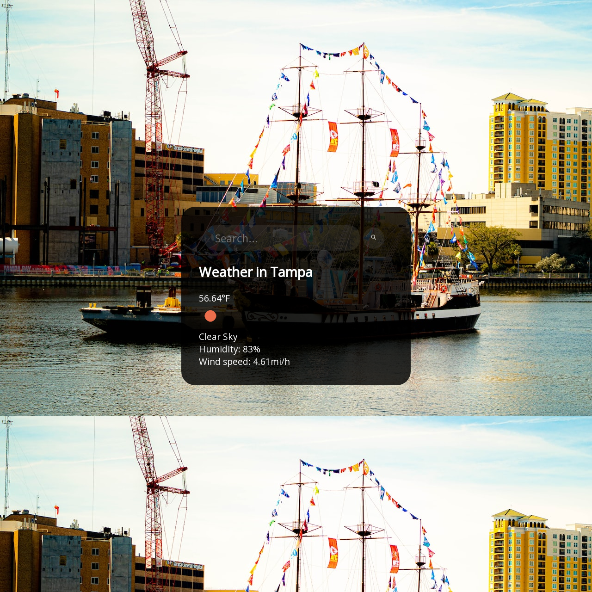

# Weather-App

**Link to project:** https://diego-weather-app.vercel.app/

## How It's Made:

**Tech used:** HTML, CSS, JavaScript, OpenWeather API, Unsplash API

I built this weather app to sharpen my skills with API's
## Optimizations

Needed optimizations: 
- Needs more responsiveness in Mobile

## Lessons Learned:

- I learned how to use the const {} to destructure objects
- I refreshed my knowledge on API's
- Learned about new colors on CSS
